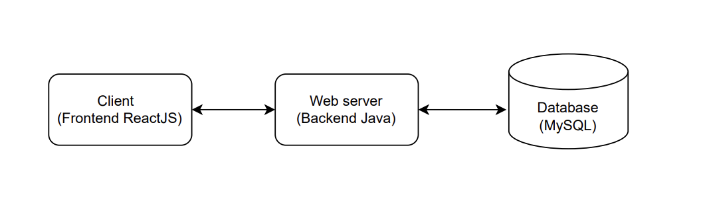

# Car Dealership API

A full-stack car dealership inventory application with a Spring Boot backend and a React frontend.

The project supports user registration, login, JWT-based authentication, role-based authorization, and vehicle inventory workflows. Customers can browse/search vehicles and purchase available stock, while admins can create, update, delete, and restock vehicles.

## Live Project

The project is live at: [https://car-dealership-api.vercel.app/](https://car-dealership-api.vercel.app/)

### Admin Login

```text
Email: admin@dealership.com
Password: admin123
```

### Architecutre



## Tech Stack


### Backend

- Java 21
- Spring Boot 4.1
- JWT authentication
- MySQL


### Frontend

- React 18
- TypeScript
- Vite
- Tailwind CSS
- Vitest


### Local Infrastructure

- Docker Compose
- MySQL 8.0


## Prerequisites

Install the following before running the project locally:

- Install java 21 from [Oracle official website](https://www.oracle.com/in/java/technologies/downloads/#jdk21-windows). Download according to your OS. It is required to compile and run the project.
- Install Gradle from [Gradle official website](https://gradle.org/install/#manually). Download the files according to your OS. It is used for compiling, testing and packaging applications.
- Install Node.js and npm from [Node.js official website](https://nodejs.org/). Download according to your OS. npm is included with Node.js. It is required to install dependencies and run the frontend project.
- Install Docker Desktop from [Docker official website](https://www.docker.com/products/docker-desktop/). Download according to your OS. It is required to run the local MySQL database with Docker Compose.
- Clone the git repository from the Github to your local machine. You can do this by
  ```
  git clone https://github.com/Atharva0418/car-dealership-api.git
  ```


## Environment Variables for Backend

Before you run backend:

Create a `.env` file in the project root.

```properties
DB_URL=jdbc:mysql://localhost:3307/dealership_db
DB_USER=dealership_user
DB_PASSWORD=dealership_pass

JWT_SECRET=replace-this-with-a-long-secure-secret
JWT_ACCESS_TOKEN_EXPIRATION_SECONDS=3600
JWT_REFRESH_TOKEN_EXPIRATION_SECONDS=604800

ADMIN_EMAIL=admin@example.com
ADMIN_PASSWORD=change-this-password

FRONTEND_ORIGINS=http://localhost:5173
```

`ADMIN_EMAIL` and `ADMIN_PASSWORD` are optional, but when both are provided the backend seeds an admin user automatically on startup. You can use these credentials to log in as admin.

## Run The Backend Locally

Start MySQL: 

Make sure docker is running in the background before executing the command below.

```powershell
docker compose up
```

Run the Spring Boot backend:

```powershell
.\gradlew bootRun
```

The backend runs on:

```text
http://localhost:3000
```


## Environment Variables for Frontend

Before you run frontend:

Create a `.env` file in the /frontend directory.

```properties
VITE_API_PROXY_TARGET=http://localhost:3000
```


## Run The Frontend Locally

Open a second terminal and move into the frontend directory:

```powershell
cd frontend
```

Install dependencies:

```powershell
npm install
```

Start the Vite dev server:

```powershell
npm run dev
```

The frontend runs on:

```text
http://localhost:5173
```

During local development, Vite proxies `/api` requests to:

```text
http://localhost:3000
```

You can override this with:

```properties
VITE_API_PROXY_TARGET=http://localhost:3000
```


## API Overview


### Authentication


| Method | Endpoint             | Description                                  |
| ------ | -------------------- | -------------------------------------------- |
| `POST` | `/api/auth/register` | Register a customer user                     |
| `POST` | `/api/auth/login`    | Log in and receive access/refresh tokens     |
| `POST` | `/api/auth/refresh`  | Exchange a refresh token for new auth tokens |


Authenticated requests should include:

```http
Authorization: Bearer <access-token>
```


### Vehicles


| Method   | Endpoint                      | Role          | Description                                               |
| -------- | ----------------------------- | ------------- | --------------------------------------------------------- |
| `GET`    | `/api/vehicles`               | Authenticated | List vehicles                                             |
| `GET`    | `/api/vehicles/search`        | Authenticated | Search vehicles by make, model, category, and price range |
| `POST`   | `/api/vehicles`               | Admin         | Create a vehicle                                          |
| `PUT`    | `/api/vehicles/{id}`          | Admin         | Update a vehicle                                          |
| `DELETE` | `/api/vehicles/{id}`          | Admin         | Delete a vehicle                                          |
| `POST`   | `/api/vehicles/{id}/restock`  | Admin         | Add stock to a vehicle                                    |
| `POST`   | `/api/vehicles/{id}/purchase` | Customer      | Purchase one unit of a vehicle                            |


## Testing

Run backend tests from the project root:

```powershell
.\gradlew  test
```

Run frontend tests from the `frontend` directory:

```powershell
npm test
```


## Docker

The project includes a `Dockerfile` for building the backend application image. This is for deployment purposes only.

Build the backend image:

```powershell
docker build -t car-dealership-api .
```


## Deployment

- Backend: deployed on Render using the project `Dockerfile` ([render.com](https://render.com)).
- Frontend: hosted on Vercel ([vercel.com](https://vercel.com)).
- MySQL database: hosted on Aiven ([aiven.io](https://aiven.io)).


## My AI Usage:

AI tools used: Codex, Claude

Claude : Used for prompts and brainstorming

Codex: Used for implementation

My Workflow:

- I start by brainstorming alone, trying to think of as many  test cases as I can. 
- Then I ask claude or codex to suggest test cases and compare them with my own. This allows me to recognize the test cases I have missed, which are important and which are optional.
- I take these test cases and ask claude to generate a prompt for Codex, asking to only write the test cases and not write any implementation code
- After the test cases have been written , I ask codex to write minimal code to pass those test cases.
- Once the feature is completed and all test cases pass, I draft a PR on Github review the code implemented by Codex, test it using Postman or browser.
- The changes are commited and the feature branch is merged after manual testing.

Honestly, I used AI (Codex) for the entire project starting from initial structure to even this readme. However, I have not been blindly committing the changes Codex gave me. I reviewed the changes, added my "taste" and tested them manually in Postman for backend and in browser for frontend. Many times it drifted from the goal of implementing the best practices and I had to refactor it (e.g. JWT refactor, directory structure).   

Leveraging Codex allowed me to boost my efficiency in making the full stack web. If I had tried to manually write the test cases and code, I wouldn't have been able to complete it on time.   

I also used Claude for brain storming , approaches , planning and prompts for Codex ( why write prompts manually when AI can do that for you? haha). 

```
git commit -m "docs: add my ai usage in readme.md
Co-authored by Me."
```

