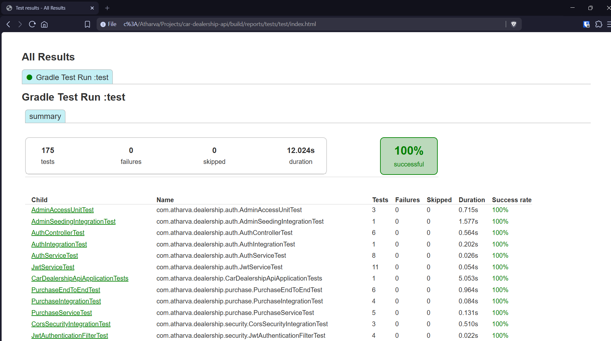
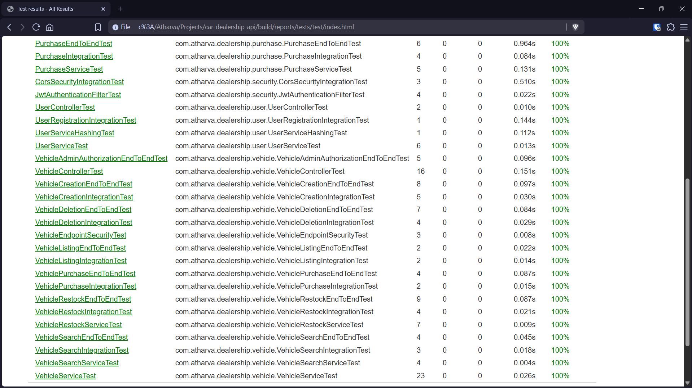
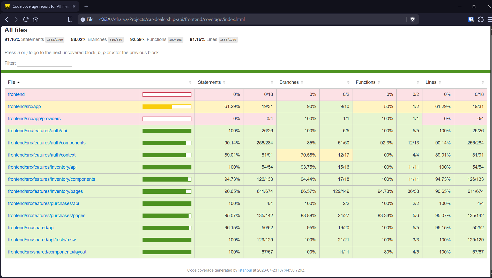

# Test Evidence

## Backend Tests





- These test reports are generated on every test run locally by: 

```powershell
.\gradlew  test
```

- Find these reports in the following directory after executing the test command:

```
root-project-directory\build\reports\tests\test\index.html
```


## Frontend Tests



- These test reports are generated on every test run locally by: 

```powershell
npx vitest test --coverage
```